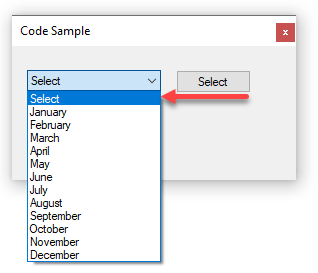

# About

Shows how to add a `Select` Option to a `ComboBox`. In this sample data is mocked but the same applies with data related data.



```csharp
public static List<MonthItem> Months()
{
    List<MonthItem> list = new List<MonthItem>() { new MonthItem() { Index = -1, Name = "Select" } };
    list.AddRange(MonthList.Select((name, index) => new MonthItem() { Index = index + 1, Name = name }));

    return list;
}
```