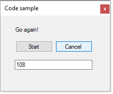

# About

Code sample for [IProgress&lt;T> Interface](https://docs.microsoft.com/en-us/dotnet/api/system.iprogress-1?view=net-5.0) and [Progress&lt;T> Class](https://docs.microsoft.com/en-us/dotnet/api/system.progress-1?view=net-5.0)

Where `Progress<T>` provides an `IProgress<T>` that invokes callbacks for each reported progress value.

Code with .NET Framework and will work with .NET Core

