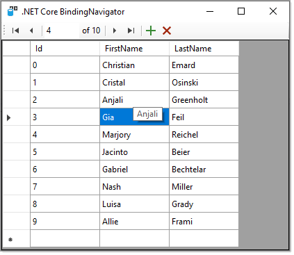

# About

Example to have a `BindingNavigator` for .NET Core.



```
Public Class CoreBindingNavigator
    Inherits BindingNavigator

    Public Sub New()
        AddStandardItems()
    End Sub

End Class
```

Data is created using Bogus.

```xml
<ItemGroup>
   <PackageReference Include="Bogus" Version="34.0.2" />
</ItemGroup>
```