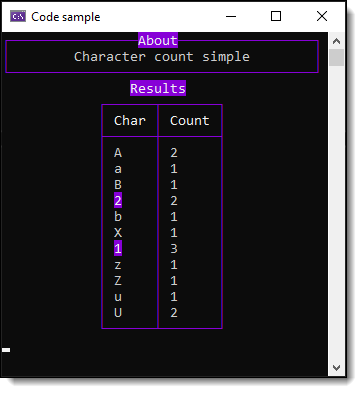

# About

Example to obtain character count in a string.

```csharp
IEnumerable<Container> containers = "AaB22bX1zZA1uUU1"
    .GroupBy(c => c)
    .Select(c => new Container(c.Key, c.Count()));
```

</br>

```csharp
public class Container
{
    public char Char { get; }
    public int Count { get; }
    public bool IsDigit => char.IsDigit(Char);

    public Container(char c, int count)
    {
        Char = c;
        Count = count;
    }

    public override string ToString() => $"{Char,-3}{Count}";

}
```

</br>


