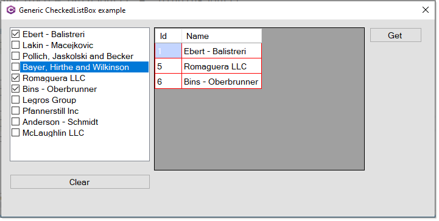

# About


- Simple example for selecting checked items in a CheckedListBox where data is a list of a model.
- Style form (for Stackoverflow questions)



```csharp
public static class CheckedListBoxExtensions
{
    /// <summary>
    /// Get checked items as <see cref="T"/>
    /// </summary>
    /// <typeparam name="T">Model</typeparam>
    /// <param name="sender">CheckedListBox</param>
    /// <returns>List if one or more items are checked</returns>
    public static List<T> CheckedList<T>(this CheckedListBox sender)
        => sender.Items.Cast<T>()
            .Where((item, index) => sender.GetItemChecked(index))
            .Select(item => item)
            .ToList();

    /// <summary>
    /// Uncheck all items
    /// </summary>
    /// <param name="sender">CheckedListBox</param>
    public static void UnCheckAll(this CheckedListBox sender)
    {
        foreach (int index in sender.CheckedIndices)
        {
            sender.SetItemCheckState(index, CheckState.Unchecked);
        }
    }
}
```