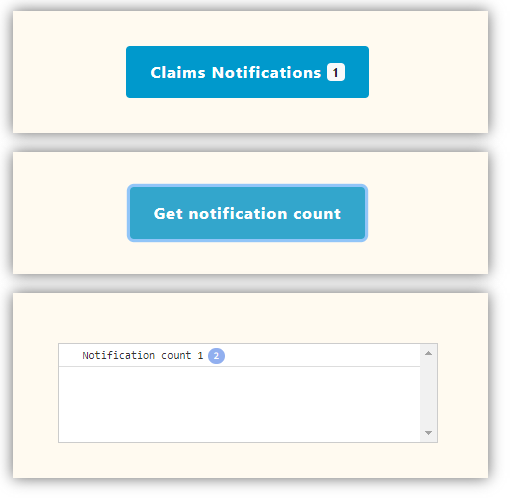
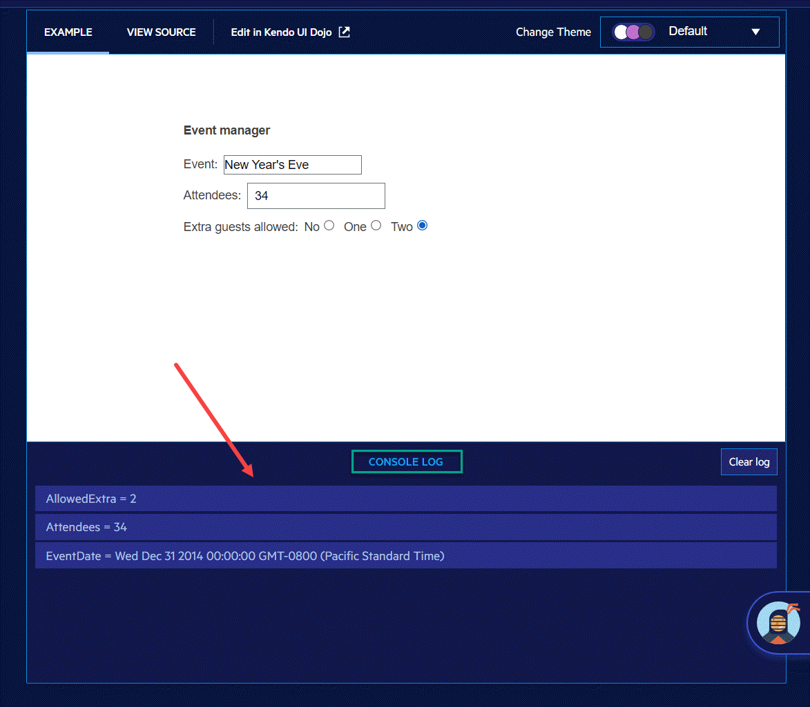

# About

Started out as a playground to experiment with different things, currently does `kendoConsole.js` under the `Scripts` folder. Ignore all the extra includes and that an older version of Bootstrap is being used, the project was created a while back

## Basic usage

Add kendoConsole.js to project and include via script tag

Create a container

```html
<div class="row">
    <div class="well-container">
        <div class="col text-center">
            <div class="console" style="overflow-y: scroll; height:100px;"></div>
        </div>
    </div>
</div>
```

Example script working off identifiers in this case on index.html

```javascript
// Increment counter
$('#btnNotifications').click(function () {
    var value = parseInt($('#lblIncrement').text());
    var newValue = value + 1;
    $('#lblIncrement').text(newValue);
});

//
// get count from #lblIncrement
//
$('#btnGetNotificationCount').click(function (event) {

    var value = parseInt($('#lblIncrement').text());
    kendoConsole.log("Notification count " + value);
});
```

Screenshot for this project



Screenshot taken from [this page](https://demos.telerik.com/kendo-ui/mvvm/types?autoRun=true&theme=default-purple).

