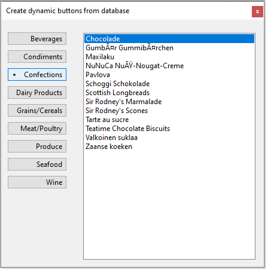

# About

An age old question by developers, how to create dynamic buttons. Usually they do not think about more than creation of buttons and not think about how to interact with the buttons in an event.

This project shows how to create dynamic buttons and present data from a SQL-Server database into a ListBox.

This is merely a primer, much more is possible.

# Important

Before running this project first create the database, script to create is in the DataScripts folder.

