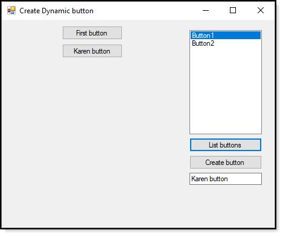
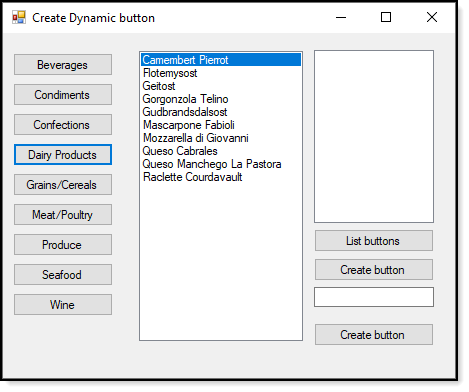

Simple code sample for creating dynamic buttons. Code for creating buttons is in a class to keep form code clean.




The following sets up constant values for creating buttons

```csharp
public static void Initialize(Control pControl, int pBase, int pBaseHeightPadding, int pLeft, int pWidth, EventHandler pButtonClick)
{
    
    ParentControl = pControl;
    Base = pBase;
    BaseHeightPadding = pBaseHeightPadding;
    Left = pLeft;
    BaseWidth = pWidth;
    EventHandler = pButtonClick;
    ButtonsList = new List<Button>();
    
}
```

Calling the above.

```csharp
Operations.Internalize(this,10,30, 100,100, GenericButtonClick);
```

GenericButtonClick event which shows how to know which button has been clicked.

```csharp
private void GenericButtonClick(object sender, EventArgs e)
{
    var button = (Button) sender;
    MessageBox.Show(button.Name);
}
```

## Practical code sample

