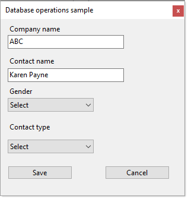

# About

Starter code sample showing

- Present user with options for selecting, in this case
  - Gender
  - Contact type
- Edit window for adding a record to a SQL-Server database table 

All data operations are in `CustomerDatabaseLibrary` class project.

Before running these projects, run the script CustomerDatabaseLibrary\Scripts\\**script.sql**

## Notes

1. The entire code sample can be done easier with EF Core but this code sample came from a forum question where the asker is not using EF.
2. Recommend using data annotation validation, for a starter see [the following repository](https://github.com/karenpayneoregon/ClassValidationVisualBasic)

