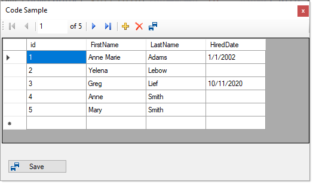

# About

Originally written to answer a forum question, now refactoring for another forum question.

All data operations are in EmployeeOperations.

## Note

- `New rows` the data shown in the DataGridView does not show the primary key, it's there but needs to be brought out with reflection.
- `Limited exception handling` only in EmployeeOperations, no assertion or try/catch in the form.
- Coded in `.NET Framework 4.8` so that those who have not transitioned to .NET Core can benefit, will work no different in a .NET Core project.

## Screenshot




## Form code

Note that I've kept code in the form to minimal, all data operations are in a class.

```csharp
using System;
using System.Windows.Forms;
using DataAdapterFormApp.Classes;

namespace DataAdapterFormApp
{

    public partial class Form1 : Form
    {
        public Form1()
        {
            InitializeComponent();
            Shown += OnShown;
        }
        private void OnShown(object sender, EventArgs e)
        {
            var (success, exception) = EmployeeOperations.Load();

            if (success)
            {
                dataGridView1.DataSource = EmployeeOperations.BindingSource;
                dataGridView1.Columns[0].ReadOnly = true;
            }
            else
            {
                SaveChangeButton.Enabled = false;
                MessageBox.Show($@"Failed to load data\n{exception.Message}");
            }

        }
        private void SaveChangeButton_Click(object sender, EventArgs e)
        {
            var (affected, exception) = EmployeeOperations.SaveChanges();
            if (exception != null)
            {
                MessageBox.Show($@"Save failed\n{exception.Message}");
            }
            else
            {
                MessageBox.Show($@"Affected records {affected}");
            }
        }
    }
}

```