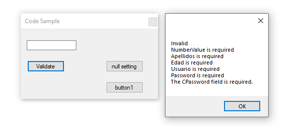

# About

:small_blue_diamond: Reply to forum [question](https://docs.microsoft.com/en-us/answers/questions/856443/how-to-get-the-text-from-textboxes-and-write-it-in.html) which demos data annotation validation

Has just enough code to allow a jump start.



### Model

With data annotations

```csharp
public class Usuarios
{
    [Required(ErrorMessage = "{0} is required"), DataType(DataType.Text)]
    [StringLength(12, MinimumLength = 3, ErrorMessage = "{0} {2} min {1} max and not empty")]
    public string NumberValue { get; set; }
    [Required(ErrorMessage = "{0} is required"), DataType(DataType.Text)]
    public string Apellidos { get; set; }
    [Required(ErrorMessage = "{0} is required"), DataType(DataType.Text)]
    public string Edad { get; set; }
    [Required(ErrorMessage = "{0} is required"), DataType(DataType.Text)]
    public string Usuario { get; set; }
    [Required(ErrorMessage = "{0} is required"), DataType(DataType.Text)]
    public string Password { get; set; }
    [Required]
    public string CPassword { get; set; }
}
```

### Validator

```csharp
public class ValidationHelper
{
    /// <summary>
    /// Validate entity against validation rules
    /// </summary>
    /// <typeparam name="T"></typeparam>
    /// <param name="entity"></param>
    /// <returns></returns>
    public static EntityValidationResult ValidateEntity<T>(T entity) where T : class
    {
        return (new EntityValidator<T>()).Validate(entity);
    }
}
```

### Usage

```csharp
private void ValidateButton_Click(object sender, EventArgs e)
{
    Usuarios current = (Usuarios)_bindingSource.Current;
    var modelEntity = ValidationHelper.ValidateEntity(current);

    if (modelEntity.IsValid)
    {
        JsonOperation.Serialize(current);
        MessageBox.Show("Valid");
    }
    else
    {
        var builder = new StringBuilder();
        modelEntity.Errors.ToList().ForEach(item => builder.AppendLine(item.ErrorMessage));
        MessageBox.Show($"Invalid\n{builder}");
    }
}
```

### See also

- [Teaching-simple-validation-1](https://github.com/karenpayneoregon/teaching-simple-validation-1)
- [DataAnnotations for .net framework, .net core framework for C# and VB.NET](https://github.com/karenpayneoregon/ClassValidationVisualBasic)
- [Validating application data with Fluent Validation](https://github.com/karenpayneoregon/teaching-simple-validation)


