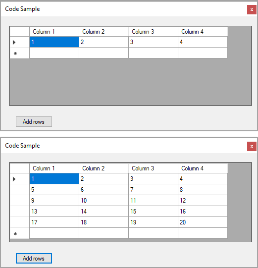

# About
Stactoverflow question

[C# Datagridview method Rows.Add works incorrectly - it add line on previous, not on last](https://stackoverflow.com/questions/72337220/c-sharp-datagridview-method-rows-add-works-incorrectly-it-add-line-on-previous)

OP sets RowCount and ColumnCount which when adding a new row added it one up from the last row. Don't know why but my advice is not to set RowCount as presented in this project.

The correct way would be to have a `DataSource` for the `DataGridView` and if a DataTable, simple add a new row or for a list add a new item which should also use a BindingList/BindingSource and if editing implement `INotifyPropertyChanged`.

