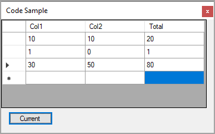

Stackoverflow [Extracting datagridview values C#](https://stackoverflow.com/questions/72190997/extracting-datagridview-values-c-sharp)

User is using a DataGridView with no DataSource and want to calculate column totals. I proposed a DataTable with a DataColumn Expression.

- Used .NET Framework 4.8, works with .NET Core too.
