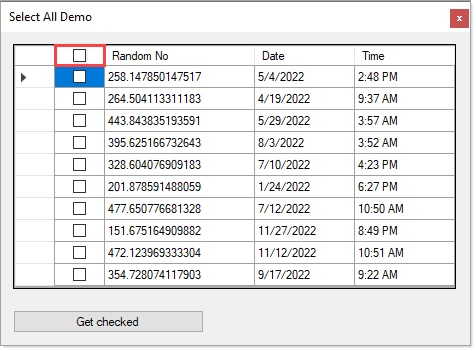

# About

Code Project [Toggling the States of all CheckBoxes Inside a DataGridView Column](https://www.codeproject.com/Articles/42437/Toggling-the-States-of-all-CheckBoxes-Inside-a-Dat)

Karen made many changes including 

1. Showing how to get checked items
2. Used [Bogus](https://github.com/bchavez/Bogus) for data
3. Changed from .NET Framework 3.5 to 4.8

 