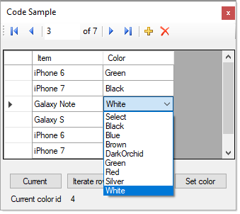

# About

Code sample for using DataGridViewComboBox.

This project is one that has been used to answer countless forum questions over the years and changes over time to reply to forum questions.

Unsure why coders/developers never understand why they must iterate rows/cells rather than iterate the data source, most likely is they search the web and find that is what many end up doing.

Main data is a product table with a relationship to a table for colors.

Two [BindingSource](https://docs.microsoft.com/en-us/dotnet/api/system.windows.forms.bindingsource?view=netframework-4.8) components are used which in this case provides access to the current row in the DataGridView. Explore working with using BindingSource which are very helpful.

**Current iteration**

- Shows how to change a ComboBox value programmically
- Iterate rows via a BindingSource

**Notes**

- .NET Core 7 
- DataTables are used, this will also work with EF Core or any data source that you can think of that will display in a DataGridView.
- Uses a custom BindingNavigator included

 

## Before running

**Run** scripts\script.sql

