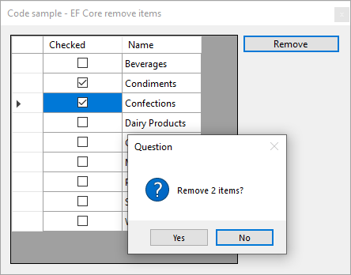

# About

Provides steps to remove items from a DataGridView with data provided by a SQL-Server table using EF Core.



To ensure we don't get a null value for the Checked column `[DefaultValue(false)]` is used and `[NotMapped]` as the `Checked` property does not belong to the model.

```csharp
public partial class Categories
{
    [NotMapped]
    [DefaultValue(false)]
    public bool Checked { get; set; }
    public int CategoryId { get; set; }
    public string CategoryName { get; set; }
}
```