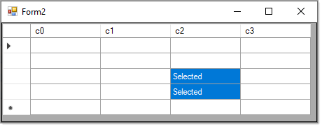

# About

Shows how to export a DataGridView contents to a text file. In this case there is a data source but that doesn't matter as the code works againsts `DataGridViewRow` and `DataGridViewCell`.

```csharp
using System;
using System.IO;
using System.Linq;
using System.Windows.Forms;

namespace DataGridViewExportTextFile.Extensions
{
    public static class DataGridViewExtensions
    {
        public static void ExportRows(this DataGridView sender, string fileName, string defaultNullValue = "(empty)")
        {
            File.WriteAllLines(fileName, (sender.Rows.Cast<DataGridViewRow>()
                .Where(row => !row.IsNewRow)
                .Select(row => new {
                    row,
                    rowItem = string.Join(",", Array.ConvertAll(row.Cells.Cast<DataGridViewCell>()
                        .ToArray(), c => ((c.Value == null) ? defaultNullValue : c.Value.ToString())))
                })
                .Select(@row => @row.rowItem)));
        }
    }
}

```

Also a code sample in Form2 for selecting cells.

