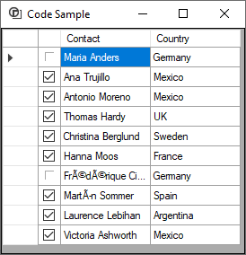

# About

Example to conditionally make a `DataGridViewCheckBox` **readonly** if Country equals Germany.

This was used to reply to this [question](https://stackoverflow.com/questions/72229444/how-to-set-color-for-checkbox-present-in-datagridview).

Will work with .NET Core, wrote this in .NET Framework as it's easier because the designer is a tad slow in VS2019.

