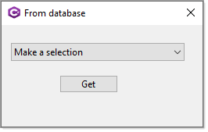

# About

Example for working with Immutable, see class project DataLibrary which you need to run a script to create a SQL-Server database and populate tables.

Can be done with EF Core also.



```csharp
public class CountryItem
{
    public int Id { get;  }
    public string Name { get;  }
    public override string ToString() => Name;

    public CountryItem(int id, string name)
    {
        Id = id;
        Name = name;
    }
```

</br>

```csharp
public static IReadOnlyList<CountryItem> CountriesReadOnly()
{
    List<CountryItem> list = new() { new CountryItem(-1, "Select") };

    using var cn = new SqlConnection(ConnectionString);
    using var cmd = new SqlCommand { Connection = cn, CommandText = "SELECT CountryIdentifier, [Name] FROM dbo.Countries;" };
    cn.Open();
    var reader = cmd.ExecuteReader();

    while (reader.Read())
    {
        list.Add(new CountryItem(reader.GetInt32(0), reader.GetString(1)) );
    }

    return list.ToImmutableList();
}
```
