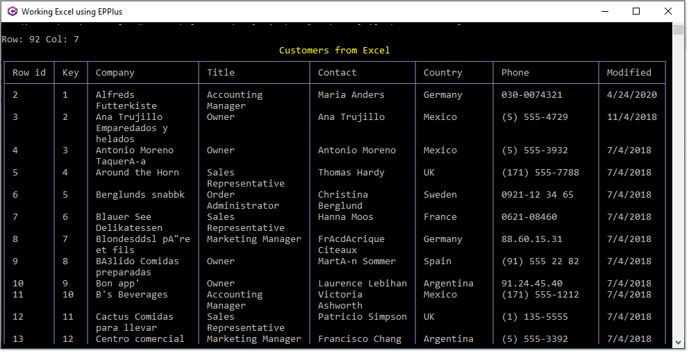

# About

Basic code samples for [EPPlus](https://www.epplussoftware.com/)

# Notes

- Requires SQL-Server Express or better
- Make sure to run the script under Scripts folder before running this project
- Uses [Spectre.Console](https://spectreconsole.net/appendix/colors)   for enhanced console output
- `EPPlus`, commercial license will be needed for use in developing applications. See [License FAQ](https://www.epplussoftware.com/en/LicenseOverview/LicenseFAQ)
