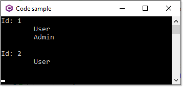

# About

Micosoft Q&A forum question

[Parse JSON Data For Insert Into SQL Table](https://docs.microsoft.com/en-us/answers/questions/866164/parse-json-data-for-insert-into-sql-table.html)

```json
{
  "Id": 0,
  "Email": "james@example.com",
  "Active": true,
  "CreatedDate": "2013-01-20T00:00:00",
  "Roles": [
    "User",
    "Admin"
  ]
}
```

And

```csharp
public partial class Account
{
    public int Id { get; set; }
    public string Email { get; set; }
    public bool? Active { get; set; }
    public DateTime? CreatedDate { get; set; }
    public string Roles { get; set; }
}
```

Insert a new record. My recommendation is to take Roles from `string` to `string array` and perform a conversion.

```csharp
public partial class Account
{
    public int Id { get; set; }
    public string Email { get; set; }
    public bool? Active { get; set; }
    public DateTime? CreatedDate { get; set; }
    public string[] Roles { get; set; }
}
```

In the DbContext

```csharp
protected override void OnModelCreating(ModelBuilder modelBuilder)
{
    modelBuilder.HasAnnotation("Relational:Collation", "SQL_Latin1_General_CP1_CI_AS");
    modelBuilder.Entity<Account>()
        .Property(e => e.Roles)
        .HasConversion(
            value => string.Join(',', value),
            value => value.Split(',', 
                StringSplitOptions.RemoveEmptyEntries));
    OnModelCreatingPartial(modelBuilder);
}
```

Then insert a new record in a console app

```csharp
using System;
using AccountsEntityFramework.Models;
using Newtonsoft.Json;

namespace AccountsEntityFramework
{
    partial class Program
    {
        static void Main(string[] args)
        {

            using var context = new Context.Context();

            var account = IncomingAccount();
            context.Add(account);
            context.SaveChanges();

            Console.WriteLine($"Id for new account {account.Id}");

            Console.ReadLine();
        }

        /// <summary>
        /// Mock-up an <see cref="Account"/>
        /// </summary>
        static Account IncomingAccount()
        {
            Account account = new ()
            {
                Active = true,
                CreatedDate = new DateTime(2013,1,20),
                Email = "james@example.com",
                Roles = new []{"User", "Admin"}
            };

            return JsonConvert.DeserializeObject<Account>(
                JsonConvert.SerializeObject(account, Formatting.Indented));
        }
    }
}

```

List accounts

```csharp
private static void ViewAccounts()
{
    using var context = new Context.Context();
    var accountList = context.Account.ToList();

    foreach (var account in accountList)
    {
        Console.WriteLine($"Id: {account.Id}");
        foreach (var role in account.Roles)
        {
            Console.WriteLine($"\t{role}");
        }

        Console.WriteLine();
    }

}
```


