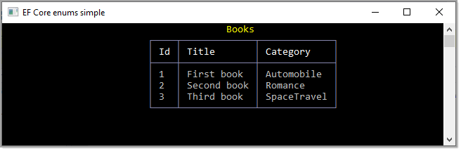
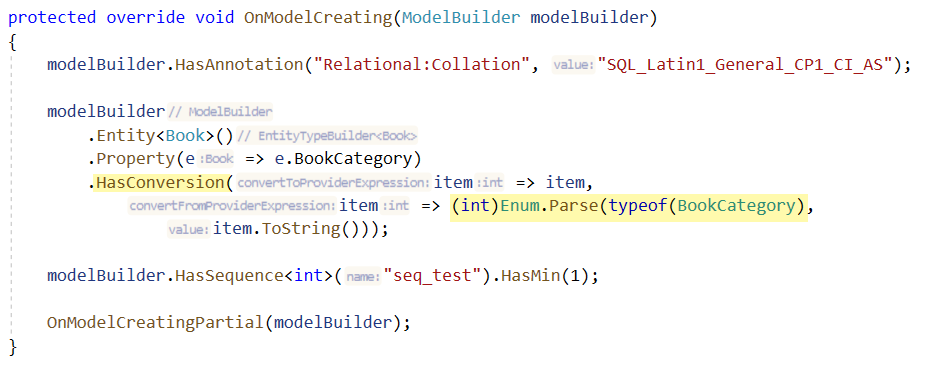

# About

[]()

Example for using an `enum` as a property for a model.



## Table

```csharp
public partial class Book
{
    public int BookId { get; set; }
    public string Title { get; set; }
    public int BookCategory { get; set; }
}
```

## enum

```csharp
public enum BookCategory
{
    SpaceTravel = 1,
    Adventure = 2,
    Romance = 3,
    Sports = 4,
    Automobile = 5
}
```

In the **DbContext**



## Tip

Create a table in a SQL-Server database, in this case named BookCategory and place each value which will be used for enum members into the table. Then use EntityFrameworkEnumSimple.Helpers\BookCategory.tt to generate the enum. This is option but can make life easier when there is a need to add new categories. If this is something you like, move the .tt file to the Classes folder so when there are updates they are available, downside is this may break application code which is why in the backend project the .tt file is in another folder.


