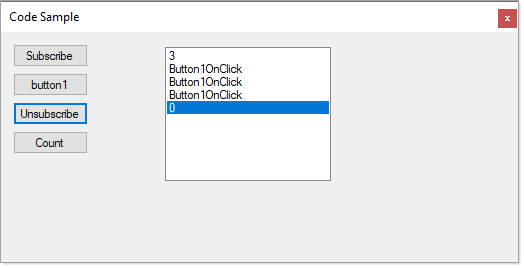

# About

Demonstrates how to unsubscribe from all events on a control of a specific event. For instance, a button Click event is subscribed more than once, this code shows how to unsubscribe from all of them.

