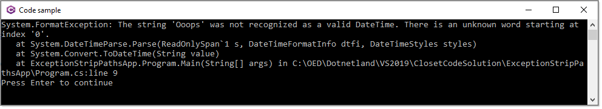
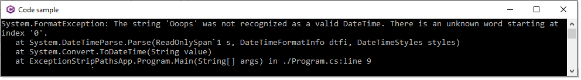

# About

Shows how to not include paths for exceptions when compile in debug mode.

Add the following to your project file

```xml
<PropertyGroup>
	<PathMap>$([System.IO.Path]::GetFullPath('$(MSBuildThisFileDirectory)'))=./</PathMap>
</PropertyGroup>
```

Without use `PathMap`



With use `PathMap`


