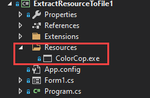
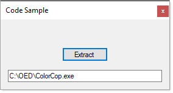

Extract file from project resource





**Language extension**

```csharp
public static class ResourceExtensions
{
    /// <summary>
    /// Given a project resource extract to desired location
    /// </summary>
    /// <param name="BytesToWrite">Resource</param>
    /// <param name="FileName">File name with extension and path is optional</param>
    public static void FileSave(this byte[] BytesToWrite, string FileName)
    {

        if (File.Exists(FileName))
        {
            File.Delete(FileName);
        }

        var FileStream = new FileStream(FileName, FileMode.OpenOrCreate);
        var BinaryWriter = new BinaryWriter(FileStream);

        BinaryWriter.Write(BytesToWrite);
        BinaryWriter.Close();
        FileStream.Close();

    }
}
```

**Usage**

```csharp
    /// <summary>
    /// ColorCop is a exe resource
    /// http://colorcop.net/
    /// </summary>
    /// <param name="sender"></param>
    /// <param name="e"></param>
    private void ExtractButton_Click(object sender, EventArgs e)
    {

        if (!string.IsNullOrWhiteSpace(FileNameTextBox.Text))
        {
            Resources.ColorCop.FileSave(FileNameTextBox.Text);
        }
           
    }
```

