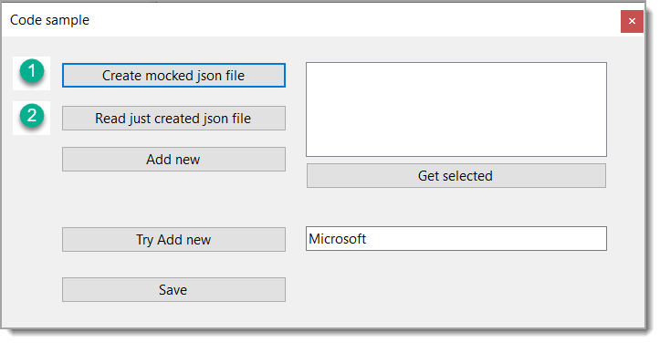
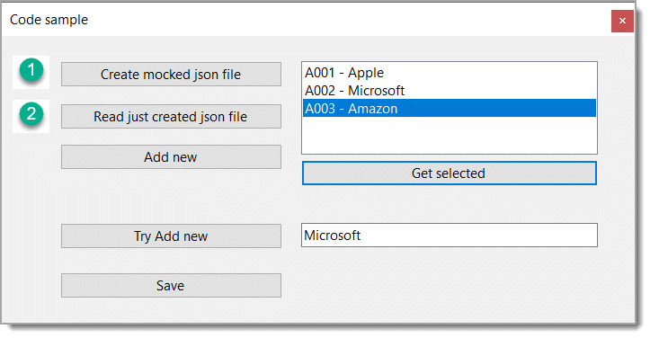
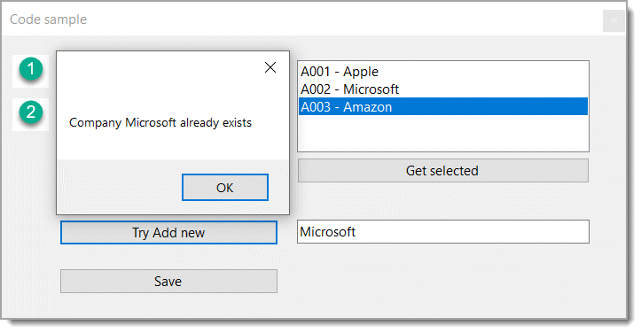

# About

Simple/basic example for using a `json file` to store information. As it's simple/basic to use this code in your own application please study the code before just copy-n-pasting and make it your own.

## Requires

Microsoft Visual Studio 2022 or higher using .NET Core 6 or higher


- Run the project
- Click the first button to generate the first file
- Click second button to populate the ListBox
- Click `Add new` to create a mocked item
- Click `Try Add new` button as is which will prevent and add since `Micosoft` is there.

## Key points

[BindingSource](https://learn.microsoft.com/en-us/dotnet/api/system.windows.forms.bindingsource?view=windowsdesktop-6.0) and [BindingList](https://learn.microsoft.com/en-us/dotnet/api/system.componentmodel.bindinglist-1?view=net-6.0) are required to make this code work, take the time to learn about both,

- The BindingList provides access to data in the ListBox without touching the ListBox.
- The BindingSource provides various things which is a stable component working with data

## Incrementing a string property

The following is used to increment the last numbers in an alphanumeric string. For more on this see the [following repository](https://github.com/karenpayneoregon/auto-incrementing-sequences)

```csharp
internal class Helpers
{
    public static string NextValue(string sender)
    {
        string value = Regex.Match(sender, "[0-9]+$").Value;
        return sender[..^value.Length] + (long.Parse(value) + 1).ToString().PadLeft(value.Length, '0');
    }
}
```







Other options

- [CSV-Helper](https://joshclose.github.io/CsvHelper/getting-started/)
- [protobuf-net.Core](https://www.nuget.org/packages/protobuf-net.Core)
