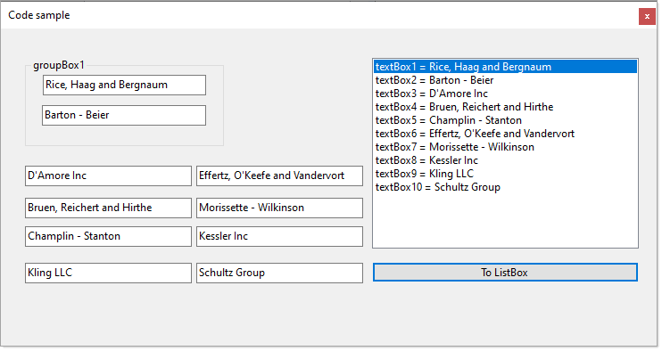

# About

A timeless question, get all controls of a specific type and optionally sort by name. The novice developer tends to not name controls so in this example we go with meaningless names.

- Get all TextBox controls into a list using an extension method
- Sort TextBox controls by trailing number, we have textBox1 through textBox10

```csharp
public static IEnumerable<T> Descendants<T>(this Control control) where T : class
{
    foreach (Control child in control.Controls)
    {
        if (child is T thisControl)
        {
            yield return (T)thisControl;
        }

        if (child.HasChildren)
        {
            foreach (T descendant in Descendants<T>(child))
            {
                yield return descendant;
            }
        }
    }
}

public static List<TextBox> TextBoxList(this Control control)
    => control.Descendants<TextBox>().ToList();
```

Each time the code sample runs text box data is populated with [Bogus](https://github.com/bchavez/Bogus) data.

