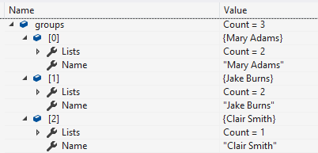

# About

Simple `groupby` on several properties of a class to get distinct instances then place into a new list.

```csharp
List<Person> distinctItems = people
    .GroupBy(person => new
    {
        person.FirstName, 
        person.LastName, 
        person.BirthDate
    })
    .Select(groupItem => groupItem.First())
    .ToList();

List<Person> distinctPeople = new(distinctItems);
foreach (var person in distinctPeople)
{
    Console.WriteLine($"{person.FirstName,-10}{person.BirthDate:d}");
}
```

For a real application it's best to disallow duplicates.

Written for a forum question where the asker was getting duplicate records inserted via EF Core while IMHO the logic prior to saving was incorrect.

**Next** written also for a forum question, return a grouping strong typed. The key is `item.ToList()`

```csharp
private static List<GroupedMember> Example1(IEnumerable<Member> list) =>
    list
        .Where(member => member.Active)
        .GroupBy(member => new { member.Name, member.Surname })
        .Select(item => 
            new GroupedMember($"{item.Key.Name} {item.Key.Surname}", item.ToList()))
        .ToList();
```



