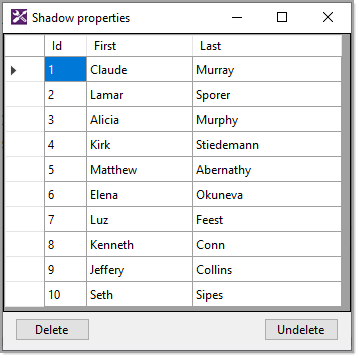

# About

👉  [Shadow properties](https://docs.microsoft.com/en-us/ef/core/modeling/shadow-properties) Jump are properties that are not defined in your .NET entity class but are defined for that entity type in the EF Core model. The value and state of these properties is maintained purely in the Change Tracker. Shadow properties are useful when there is data in the database that should not be exposed on the mapped entity types. Code samples presented will provided simple, useful examples for using shadow properties using a class project for Entity Framework Core code logic with a Windows form project to present data from a SQL-Server database.

See configuration in ShadowContext.OnModelCreating

```csharp
modelBuilder.Entity<Contact1>()
    .HasQueryFilter(contact =>
        EF.Property<bool>(contact, "isDeleted") == _ShowDeleted);
```

In this project, select a row in the DataGridView, click the `Delete` button, on SaveChanges the entity state is changed from deleted to modified and the `isDeleted' value is set which in turn will not display the record unless a query is done with [IgnoreQueryFilters](https://docs.microsoft.com/en-us/dotnet/api/microsoft.entityframeworkcore.entityframeworkqueryableextensions.ignorequeryfilters?view=efcore-6.0).

<br>

