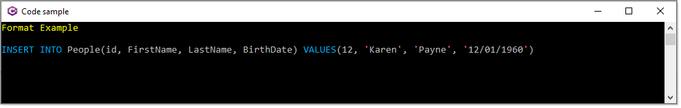

# About

Simple example for `IFormatProvider` which should not be used in a production application unless you fully understand this code.

From

```csharp
Person person = new() { Id = 12, FirstName = "Karen", LastName = "Payne", BirthDate = new DateTime(1960, 9, 1) };
    return Sql($"INSERT INTO People(id, FirstName, LastName, BirthDate) VALUES({person.Id}, {person.FirstName}, {person.LastName}, {person.BirthDate})");
```

To (coloring for console only)


