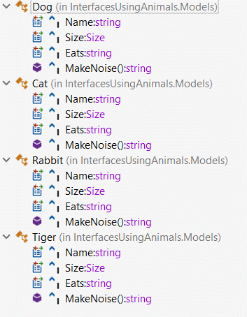
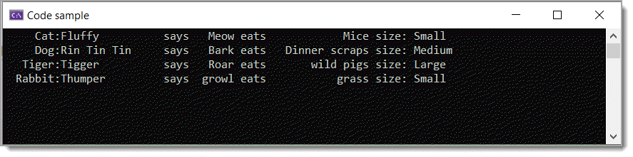

# About

Basic example for using `interfaces`



```csharp
public interface IAnimal
{
    public string Name { get; set; }

    public Size Size { get; set; }

    public string Eats { get; set; }

    string MakeNoise();
}
```

</br>

```csharp
private static void JustDoIt()
{
    List<IAnimal> animals = new()
    {
        new Cat() { Name = "Fluffy", Size = Size.Small, Eats = "Mice" },
        new Dog() { Name = "Rin Tin Tin", Size = Size.Medium, Eats = "Dinner scraps" },
        new Tiger() { Name = "Tigger", Size = Size.Large, Eats = "wild pigs" },
        new Rabbit() { Name = "Thumper", Size = Size.Small, Eats = "grass" }
    };

    foreach (var animal in animals)
    {
        Console.WriteLine($"{animal.GetType().Name,8}:{animal.Name,-15} says {animal.MakeNoise(),6} eats {animal.Eats,15} size: {animal.Size}");
    }
}
```

