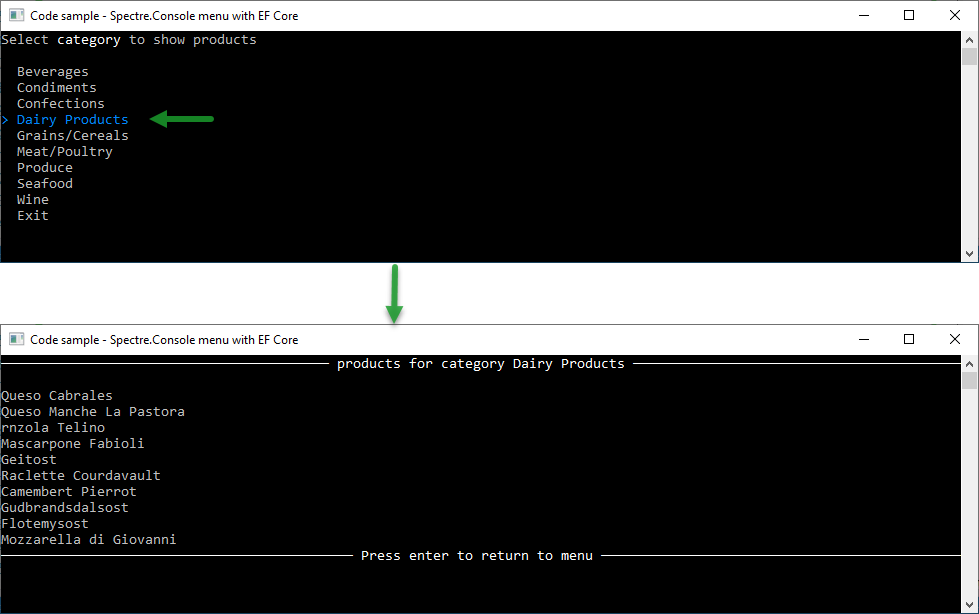

# About

This project shows how to create a menu using [Spectre.Console](https://spectreconsole.net/) with data coming from a SQL-Server database (script to create database included in the Scripts folder) reading data using EF Core.

# Notes

Program is a `partial` class, the important code resides under the Classes folder.

What the docs for Spectre.Console does not make clear is how to change the highlight color of a menu, the code below does this.

```csharp
private static SelectionPrompt<Categories> ConfigureSelectionPrompt()
{
    SelectionPrompt<Categories> selection = new SelectionPrompt<Categories>().Title("Select[b] [white]category[/][/] to show products");
    selection.HighlightStyle = new Style(Color.DodgerBlue1, Color.Black, Decoration.None);
    return selection;
}
```

