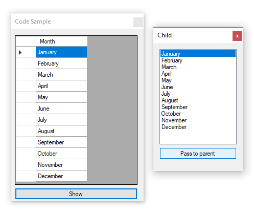

# About

For answering forum questions. Over the years coders will ask how to pass data from child to parent form and in many cases will pass say a large DataGridView between forms.

Rather than pass controls to and from forms this code sample, generic, shows a simple use of an event to pass from child to parent and avoid duplication. No data source is used for the parent form’s DataGridView as in many cases a) confuses the coder b) they are not using a data source and just want a solution.

