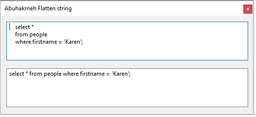

# About

Sample code for `Microsoft.SqlServer.TransactSql.ScriptDom`

- Format one line SQL into multiple lines
- Get parameter names of a parameterize query.

There is much more available so get out and explore.

Then there is [Flatten Strings with Regex.Replace](https://khalidabuhakmeh.com/flatten-strings-with-regex-replace) by [Khalid Abuhakmeh](https://khalidabuhakmeh.com/about) which is basically the reverse of code in form FormatOneLineForm.

```csharp
public static class StringExtensions
{
    private static readonly Regex Whitespace = new(@"\s+");

    public static string Flatten(this string value)
        => value is null or "" ? 
            value : 
            Whitespace.Replace(value.Trim(), " ");

    public static string Sql(string value) 
        => Flatten(value);
}
```

</br>

