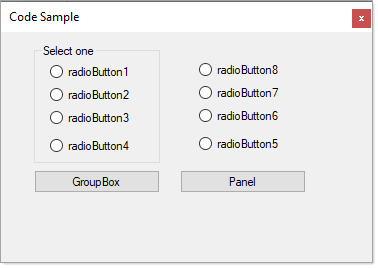

# About

Many times a new coder will want a user to select one selection from multiple `CheckBox` controls in a group, this is wrong, instead place `RadioButton` controls in a `GroupBox` and un-selection all RadioButton controls to start unless there should be a default selection.



In this code sample, all radio buttons are un-selected and then in a button click assert for a selection.

```csharp
namespace RadioButtonApp
{
    public partial class Form1 : Form
    {
        private List<RadioButton> _radioButtons;
        public Form1()
        {
            InitializeComponent();
            Shown += OnShown;
        }

        private void OnShown(object sender, EventArgs e)
        {
            _radioButtons = OptionsGroupBox.Controls.OfType<RadioButton>().ToList();
            _radioButtons.ForEach(rb => rb.Checked = false);
        }

        private void CheckSelectionButton_Click(object sender, EventArgs e)
        {
            var selection = _radioButtons.FirstOrDefault(x => x.Checked);
            if (selection == null)
            {
                MessageBox.Show("Make a selection");
            }
            else
            {
                MessageBox.Show($"You selected {selection.Text}");
            }
        }
    }
}

```