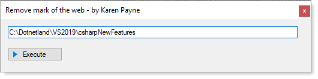

# About

Something that plagues developers is `mark of the web` (MOTW).

When decompressing a zip file downloaded from a web site or downloaded from a GitHub repository, the Windows operating system marks files as blocked which is known as `mark of the web`.

The Mark of the Web is a feature that was introduced by Microsoft to determine the origin of a file. If a file was downloaded from the Internet 

Search the web for mark of the web and found hundreds of post asking what is mark of the web, how do I removed mark of the web.

There are ways to deal with this through active directory yet many organizatons do not allow users or developers to alter these settings so this is where this utility comes in handy.

This utility accepts a folder which is used in a PowerShell script executed in this C# executable to remove the `mark of the web`. 

# Usage

- Pass a command-line argument of a folder to remove MOTW
- Drop a folder from Windows Explorer into the TextBox to remove MOTW
- Paste from the Windows clipboard a folder to remove MOTW

Click the Execute button, wait for the message box to display indicating success or failure.



# Notes

- Requires PowerShell which executes a command on the folder selected.
- Written with .NET Framework 4.8 as some developers may not have moved to .NET Core yet.

# Core code

`WaitForExiAsync` is a language extension method included in source code.

```csharp
class Utilities
{
    public static async Task UnblockFiles(string folderName)
    {
        if (!Directory.Exists(folderName))
        {
            return ;
        }

        var start = new ProcessStartInfo
        {
            FileName = "powershell.exe",
            RedirectStandardOutput = true,
            Arguments = $"Get-ChildItem -Path '{folderName}' -Recurse | Unblock-File",
            CreateNoWindow = true, 
            UseShellExecute = false
        };

        using (var process = Process.Start(start))
        {
            await process.WaitForExitAsync();
        }

    }
}
```