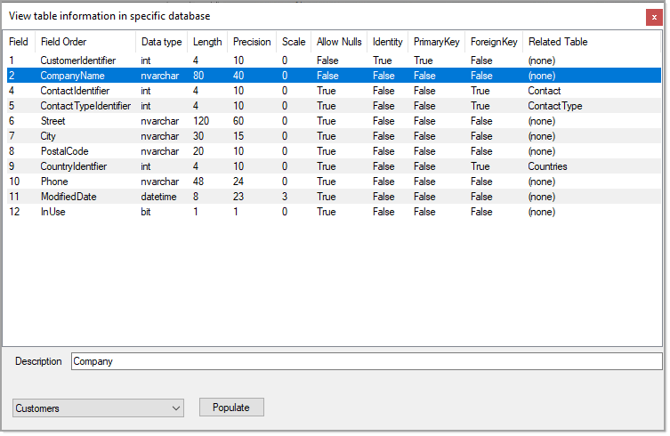

## Example working with SQL-Server table definitions

Using a query targeting a single database displays table names in a ComboBox, select a table from the ComboBox, press a button which in turn populates a ListView with table definitions including related tables.

This maybe expanded to have a Window controls e.g. ListBox or ComboBox to display databases. Select a database, in the SqlServerOperations.SqlInformation class change the default catalog to the selected database which now provides the ability to work with any database the operator has permissions to work with.

## Permissions
See the [following repository](https://github.com/karenpayneoregon/SqlServerUserLoginSharp) for how to login a user with required permissions if needed when not using SQL-Server login or Windows authenication.