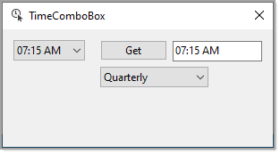

# About



A TimeComboBox, a port from an old VB.NET control discussed in a Microsoft TechNet article done in C#

[C# Working with SQL-Server time type in Windows forms](https://social.technet.microsoft.com/wiki/contents/articles/52218.c-working-with-sql-server-time-type-in-windows-forms.aspx)

[GitHub repository](https://github.com/karenpayneoregon/WorkingWithTimeInVisualStudio)

**Added since the article above**

Changed Time property from

```csharp
[Category("Behavior"), Browsable(true), Editor(typeof(Editor), typeof(UITypeEditor)), Description("Hour get/set")]
public string Time
{
    set
    {
        _hour = value;
        SetHour();
    }
    get => _hour;
}
```

To 

```csharp
[Category("Behavior"), Browsable(true), 
Description("Hour get/set")]
[TypeConverter(typeof(FormatStringConverter))]
public string Time
{
    set
    {
        _hour = value;
        SetHour();
    }
    get => _hour;
}
```

Because the above provided no drop-down while using the following class provides a proper drown down

```csharp
public partial class TimeComboBox
{
    public class FormatStringConverter : StringConverter
    {
        public override bool GetStandardValuesSupported(ITypeDescriptorContext context) => true;
        public override bool GetStandardValuesExclusive(ITypeDescriptorContext context) => true;

        public override StandardValuesCollection GetStandardValues(ITypeDescriptorContext context)
        {
            var hours = new Hours();
            return new StandardValuesCollection(hours.Range(TimeIncrement.Quarterly));
        }
    }
}
```


