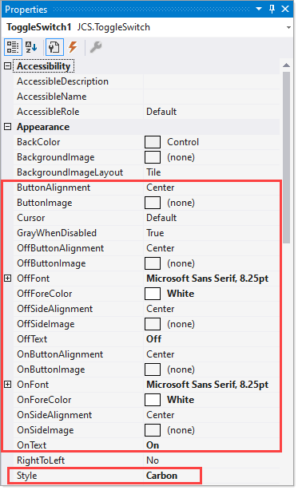

# About

This project demonstrates using a custom control to create a toggle switch appearance.

Base code is from the following code project [page](https://www.codeproject.com/Articles/1029499/ToggleSwitch-Winforms-Control).

Appearance is done using the following enum by setting the `Style` property shown below.

```csharp
public enum ToggleSwitchStyle
{
    Metro,
    Android,
    IOS5,
    BrushedMetal,
    OSX,
    Carbon,
    Iphone,
    Fancy,
    Modern,
    PlainAndSimpel
}
```

Properties to set 



# Modifications

- Karen 
  - Added MainForm and ChildForm
  - Container class
  - All code in MainForm and ChildForm
  - Change .NET Framework from 4 to 4.8
  
Should work fine in .NET Core Framework 