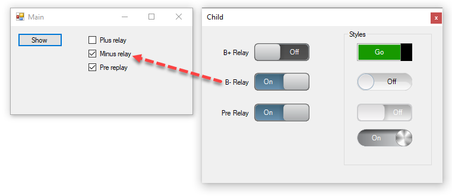

# About

This project demonstrates using a custom control to create a toggle switch appearance.

See class project ToggleSwitch for full source code



### Container

The following class is used to store settings in the main form passed from the child form via an event.

```csharp
/// <summary>
/// Class for remembering settings
/// </summary>
/// <remarks>
/// <see cref="INotifyPropertyChanged"/> provides change control between two forms
/// </remarks>
public class Container : INotifyPropertyChanged
{
    private bool _bPlusRelay;
    private bool _bMinusRelay;
    private bool _preRelay;

    public bool BPlusRelay
    {
        get => _bPlusRelay;
        set
        {
            _bPlusRelay = value;
            OnPropertyChanged();
        }
    }

    public bool BMinusRelay
    {
        get => _bMinusRelay;
        set
        {
            _bMinusRelay = value;
            OnPropertyChanged();
        }
    }

    public bool PreRelay
    {
        get => _preRelay;
        set
        {
            _preRelay = value;
            OnPropertyChanged();
        }
    }

    public event PropertyChangedEventHandler PropertyChanged;
    protected virtual void OnPropertyChanged([CallerMemberName] string propertyName = null)
    {
        PropertyChanged?.Invoke(this, new PropertyChangedEventArgs(propertyName));
    }

}
```

### Child form delegate/event

```csharp
public delegate void OnClicked(OperationType operationType, bool state);
public event OnClicked ClickedEvent;
```

### Child form code

In `SetProperties` each toggle control has it's Tag set to match up with a property in `Container` class along with subscring to the OnCheckChange event which is used to provides the information back to the main form.

```csharp
public void SetProperties()
{

    ToggleSwitch1.Tag = OperationType.BPlusRelay;
    ToggleSwitch2.Tag = OperationType.BMinusRelay;
    ToggleSwitch3.Tag = OperationType.PreRelay;
    ToggleSwitch4.Tag = OperationType.CycleCount;
    ToggleSwitch5.Tag = OperationType.PairDown;
    ToggleSwitch6.Tag = OperationType.TestMode;
    ToggleSwitch7.Tag = OperationType.StandbyMode;

    ToggleSwitch1.Checked = _container[0].BPlusRelay;
    ToggleSwitch2.Checked = _container[0].BMinusRelay;
    ToggleSwitch3.Checked = _container[0].PreRelay;


    var list = Controls.OfType<JCS.ToggleSwitch>().ToList();

    foreach (var toggleSwitch in list)
    {
        toggleSwitch.CheckedChanged += ToggleSwitchOnCheckedChanged;
    }
}

private void ToggleSwitchOnCheckedChanged(object sender, EventArgs e)
{
    var current = (JCS.ToggleSwitch)sender;
    ClickedEvent?.Invoke((OperationType)current.Tag, current.Checked);
}
```

### Main Form

`ClickedEvent` is triggered from ChildForm `ToggleSwitchOnCheckedChanged` event

```csharp
private void ClickedEvent(OperationType operationType, bool state)
{
    switch (operationType)
    {
        case OperationType.BPlusRelay:
            _container[0].BPlusRelay = state;
            break;
        case OperationType.BMinusRelay:
            _container[0].BMinusRelay = state;
            break;
        case OperationType.PreRelay:
            _container[0].PreRelay = state;
            break;
        case OperationType.CycleCount:
            // TODO
            break;
        case OperationType.PairDown:
            // TODO
            break;
        case OperationType.TestMode:
            // TODO
            break;
        case OperationType.StandbyMode:
            // TODO
            break;

    }
}
```