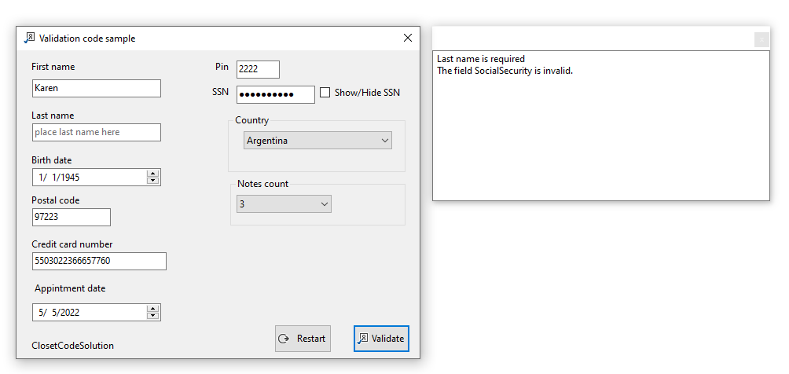
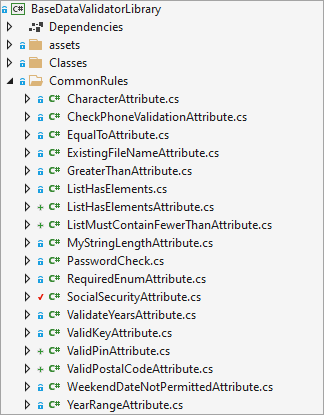

# About

This project provides the basics to intermediate level methods for validating an instance of a model (class) using [Data Annotations](https://docs.microsoft.com/en-us/dotnet/api/system.componentmodel.dataannotations?view=net-6.0).

For learning validation error messages are shown in a child form rather than an error provider or dialog.

Custom rules

