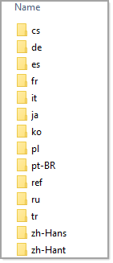
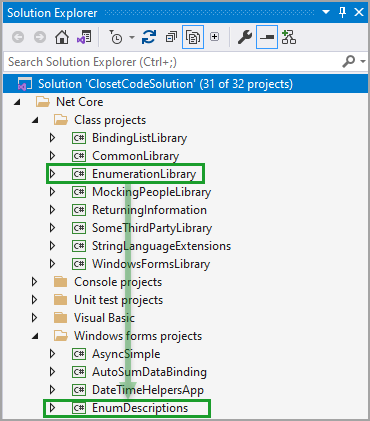

# Various tips and tricks

**How to not generate language folders.**

Add the following to .csproj

Slim down to, in this case three

```xml
	<PropertyGroup>
		<LangVersion>9.0</LangVersion>
		<TargetFramework>net5.0</TargetFramework>
		<IsPackable>false</IsPackable>
		<SatelliteResourceLanguages>en;de;pt</SatelliteResourceLanguages>
	</PropertyGroup>
```

Slim down to one

```xml
	<PropertyGroup>
		<LangVersion>9.0</LangVersion>
		<TargetFramework>net5.0</TargetFramework>
		<IsPackable>false</IsPackable>
		<SatelliteResourceLanguages>en</SatelliteResourceLanguages>
	</PropertyGroup>
```



**Add project reference alternative**

Usually to add a project reference, right click, `add`, `project reference` and select. An alternate is to click on the project to add to another project, while holding down the mouse button drag to the current project and release.


