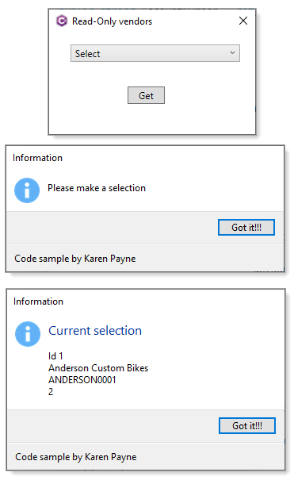

# About

In this project the developer uses a third party library, in this case named ThirdPartyLibrary include in this Visual Studio solution which in real life the developer would not have the source code.

The vendor does not want items from a collection of vendors to be changes so the list is created using [IReadOnlyList](https://docs.microsoft.com/en-us/dotnet/api/system.collections.generic.ireadonlylist-1?view=net-6.0)&lt;Vendor> which means items can not be added, removed along with property values can not be changed.

```csharp
public class Vendor
{
    public int Id { get;  }
    public string AccountNumber { get; }
    public string DisplayName { get;  }
    public int CreditRating { get;  }

    public override string ToString() => DisplayName;

    public Vendor(int id, string accountNumber, string displayName, int creditRating)
    {
        Id = id;
        AccountNumber = accountNumber;
        DisplayName = displayName;
        CreditRating = creditRating;
    }
}
```

## Collection of vendors

Data in real life may be hard coded, read from a web server or a protected database.

```csharp
public static IReadOnlyList<Vendor> Vendors() => new List<Vendor>()
    {
        new (1,"ANDERSON0001","Anderson Custom Bikes",2),
        new (2,"BERGERON0001","Bergeron Off-Roads",1),
        new (3,"BICYCLE0001","Bicycle Specialists",1),
        new (4,"CAPITAL0001","Capital Road Cycles",3),
        new (5,"ELECTRON0001","Electronic Bike Co.",1)
    };
```

# XAML

```xml
<ComboBox
    x:Name="VendorsCombobox"
    Grid.Column="1"
    Width="214"
    Height="22"
    HorizontalAlignment="Center"
    VerticalAlignment="Center"
    DisplayMemberPath="DisplayName"
    ItemsSource="{Binding Path=VendorEntries}" />
```

# Load data

```csharp
public MainWindow()
{
    InitializeComponent();

    VendorModel vm = new VendorModel();
    DataContext = vm;
}
```


## View Model


```csharp
public class VendorModel : INotifyPropertyChanged
{
    private readonly CollectionView _vendorEntries;
    private string _vendorEntry;

    public VendorModel()
    {
        IReadOnlyList<Vendor> list = References.Vendors();
        _vendorEntries = new CollectionView(list);
    }

    public CollectionView VendorEntries => _vendorEntries;

    public string VendorEntry
    {
        get => _vendorEntry;
        set
        {

            if (_vendorEntry == value)
            {
                return;
            }

            _vendorEntry = value;

            OnPropertyChanged();
        }
    }

    public event PropertyChangedEventHandler PropertyChanged;
    protected virtual void OnPropertyChanged([CallerMemberName] string propertyName = null)
    {
        PropertyChanged?.Invoke(this, new PropertyChangedEventArgs(propertyName));
    }
}
```

# Screen shots

Note the dialogs are native [TaskDialog](https://docs.microsoft.com/en-us/dotnet/api/system.windows.forms.taskdialog?view=windowsdesktop-6.0) where there are code samples in the following GitHub [repository](https://github.com/karenpayneoregon/task-dialog-csharp).

