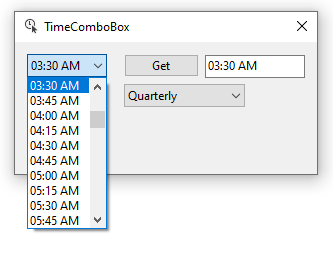

# About

Custom or missing controls in VS2019

| File        |   Description    |   Comments |
|:------------- |:-------------|:-------------|
| ButtonOperations.cs | Provides code to dynamically create buttons for window forms project | See CreateDynamicButtons project for usage |
| CoreBindingNavigator | .NET Core windows forms is missing a BindingNavigator, this gives one | Either add the class to your project or add this class project to your solution or add it to the Visual Studio ToolBox  |
| CustomButton | Provides a property of type string  |  |
| CustomLabel | Provides a property of type string  |  |
| CustomPanel | Provides a property of type string  |  |
| DataButton | Provides several extra properties  |  |
| TimeComboBox | Provides a ComboBox as shown below | Demo in project TimeComboboxApp |
|  |  |  |

:small_orange_diamond: TimeComboBox

:small_orange_diamond: CustomButton, CustomLabel, CustomPanel as per above add a string property but could be any type.

