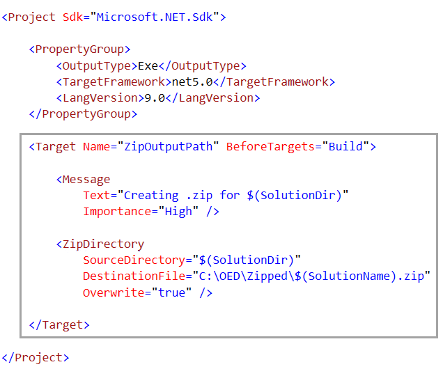

# How to create a .zip file for a Visual Studio solution

Although developers can create a GitHub repository, send a link to another developer which in turn can clone the repository there may be a need to create a .zip file of the Visual Studio solution.

When working with .NET Core projects this can be done by creating a do nothing console project and add commands to the project file to compress the entire solution into a folder under the physical path of the solution or even better, compress to a file in an entirely different location.

# Steps to setup

1. Create a new solution folder in Solution Explorer, name it `BuldTools`.
2. Under `BuldTools` create a new .NET Core Console project
3. Add a section (as shown below) `<Target Name="ZipOutputPath" BeforeTargets="Build">`
4. For `DestinationFile`, change `C:\OED\Zipped` to the path the .zip file will be created.
5. **Important** you do not want to create a .zip file on each build so we need to do the following
   1. Right click on the top node in Solution Explorer
   2. Select Coniguration manager
   3. Select the project in step 2
   4. Uncheck the Build checkbox

# Compressing when ready

1. Perform a clean on the entire project
2. Open configuration manager
3. Check the Build CheckBox
4. Now build the project from above, step 2 in `Steps to setup`
5. Open configuration manager
6. UnCheck the Build CheckBox
7. Build the entire solution

# Is this not a lot of work?

It can be, why not just clean the solution, open the solution in file explorer and create a zip file? Yes that is an option but some may want to perform the compression inside of Visual Studio. Using a MS-Build Task provides another option.

### Macros

You can use any of these macros to specify locations for files, or to get the actual name of the input file in the case of multiple selections. These macros are not case-sensitive.

||Macro|Description|
|-----------|-----------|-----------------|
||`$(ConfigurationName)`|The name of the current project configuration, for example, "Debug".|
||`$(OutDir)`|Path to the output file directory, relative to the project directory. This resolves to the value for the Output Directory property. It includes the trailing backslash '\\'.|
||`$(DevEnvDir)`|The installation directory of Visual Studio (defined with drive and path); includes the trailing backslash '\\'.|
||`$(PlatformName)`|The name of the currently targeted platform. For example, "AnyCPU".|
||`$(ProjectDir)`|The directory of the project (defined with drive and path); includes the trailing backslash '\\'.|
||`$(ProjectPath)`|The absolute path name of the project (defined with drive, path, base name, and file extension).|
||`$(ProjectName)`|The base name of the project.|
||`$(ProjectFileName)`|The file name of the project (defined with base name and file extension).|
||`$(ProjectExt)`|The file extension of the project. It includes the '.' before the file extension.|
|:heavy_check_mark:|`$(SolutionDir)`|The directory of the solution (defined with drive and path); includes the trailing backslash '\\'.|
|:heavy_check_mark:|`$(SolutionPath)`|The absolute path name of the solution (defined with drive, path, base name, and file extension).|
|:heavy_check_mark:|`$(SolutionName)`|The base name of the solution.|
|:heavy_check_mark:|`$(SolutionFileName)`|The file name of the solution (defined with base name and file extension).|
||`$(SolutionExt)`|The file extension of the solution. It includes the '.' before the file extension.|
||`$(TargetDir)`|The directory of the primary output file for the build (defined with drive and path). It includes the trailing backslash '\\'.|
||`$(TargetPath)`|The absolute path name of the primary output file for the build (defined with drive, path, base name, and file extension).|
||`$(TargetName)`|The base name of the primary output file for the build.|
||`$(TargetFileName)`|The file name of the primary output file for the build (defined as base name and file extension).|
||`$(TargetExt)`|The file extension of the primary output file for the build. It includes the '.' before the file extension.|

:heavy_check_mark: Denotes useful for compressing files.