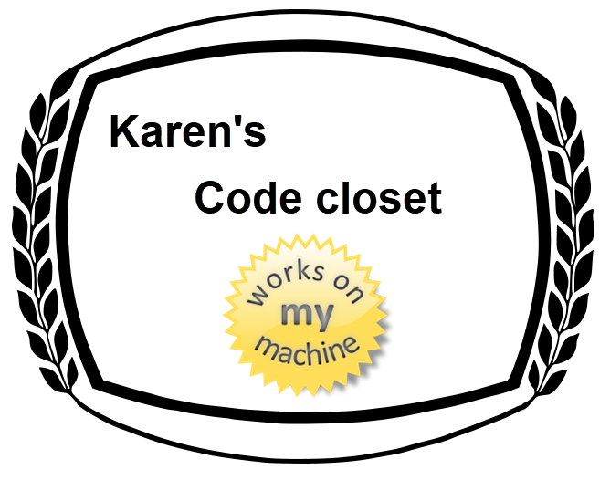

# About

This repository is home to `useful` and `obscure` code samples.

For example using a range in a foreach

```csharp
foreach (var index in 1..3)
{
    Debug.WriteLine($"{owners[index], -4} owns a {pets[index]}");
}
```

Or a complete enum value converter in EF Core

```csharp
protected override void OnModelCreating(ModelBuilder modelBuilder)
{
    modelBuilder
        .Entity<Book>()
        .Property(e => e.BookVariantId)
        .HasConversion<int>();

    modelBuilder
        .Entity<BookVariant>()
        .Property(e => e.BookVariantId)
        .HasConversion<int>();

    modelBuilder
        .Entity<BookVariant>().HasData(
            Enum.GetValues(typeof(BookVariantId))
                .Cast<BookVariantId>()
                .Select(e => new BookVariant()
                {
                    BookVariantId = e,
                    Name = e.ToString()
                })
        );
}
```

Or perhaps home-brewed data annotations

```csharp
[AttributeUsage(AttributeTargets.Field | AttributeTargets.Property)]
public class YearRangeAttribute : ValidationAttribute
{
    public YearRangeAttribute(int maximumYear)
    {
        MaximumYear = maximumYear;
    }
    /// <summary>
    /// Maximum permitted year
    /// </summary>
    public int MaximumYear { get; }
    /// <summary>
    /// Minimum permitted year
    /// </summary>
    public int MinimumYear { get; set; }
    public override string FormatErrorMessage(string name)
    {
        if (ErrorMessage is null && ErrorMessageResourceName is null)
        {
            ErrorMessage = "'Year {0}' and/or year '{1}' are invalid";
        }

        return $"{name} year must be between {MinimumYear} and {MaximumYear}";

    }

    public override bool IsValid(object sender)
        => ((DateTime)sender).Year.Between(MinimumYear, MaximumYear);
}
```

In regards to obscure, this means fringe case code that is seldom needed but when needed woohoo.

In some instances, code to use will be in one project, other times placed into class projects and when code is separated the markdown files will indicate this.

**Notes**

This line indicates that the namespace does not match it's location and should not even if not using `Resharper`.

```csharp
// ReSharper disable once CheckNamespace - do not change
```

**Windows forms**

Some examples are windows form specific while others simply can be understood better in a form rather than a console or test project.

## .NET Frameworks

The majority of code has been done using .NET Core 5 while a handful use .NET Framework 4.8

# Credits

- In some cases code samples are from Stackoverflow questions were I've written out the solution or taken someone elses solution.
- Other code samples are from [Khalid Abuhakmeh](https://khalidabuhakmeh.com/about)
- 98 percent of code presented have been written by Karen Payne.